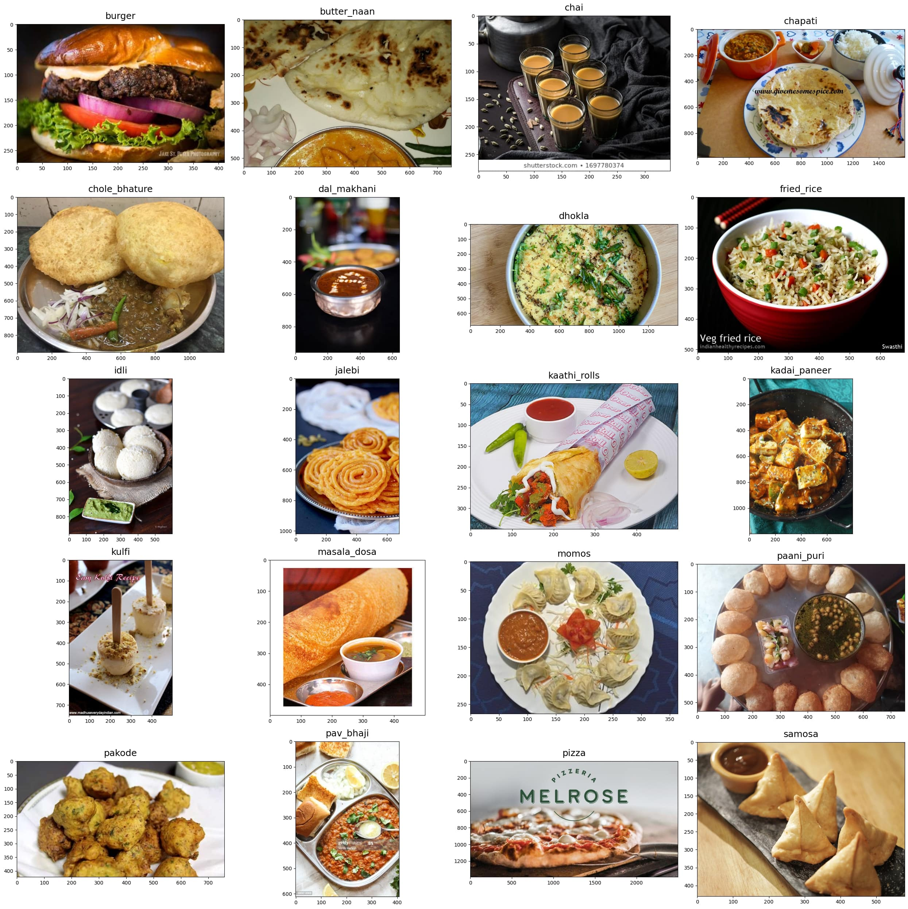
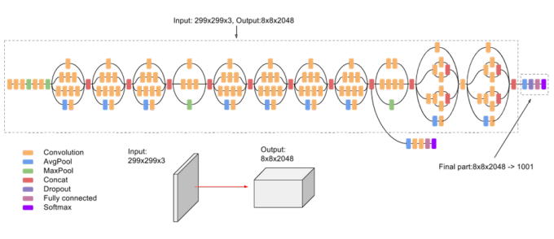

# Indian Food Classification using InceptionV3

This project leverages deep learning to classify Indian food images into 20 categories using InceptionV3 with transfer learning. The goal is to create an accurate and robust model that can distinguish between visually similar dishes, aiding food recognition for various applications.

## Table of Contents
- [Project Overview](#project-overview)
- [Features](#features)
- [Dataset](#dataset)
- [Model Architecture](#model-architecture)
- [Training and Evaluation](#training-and-evaluation)
- [Results](#results)
- [Applications](#applications)

## Project Overview
Indian cuisine is known for its variety and visual complexity, making it a challenging problem for image classification models. This project addresses this challenge by using transfer learning with InceptionV3, a powerful convolutional neural network (CNN) model pre-trained on ImageNet. The model is fine-tuned to classify Indian food into categories such as Samosa, Masala Dosa, Chai, Pav Bhaji, and more.

## Features
- **Food Classification:** Classifies 20 different Indian food categories with high accuracy.
- **Transfer Learning:** Uses pre-trained InceptionV3 weights from ImageNet for faster convergence and improved accuracy.
- **Data Augmentation:** Applies image transformations such as zoom, flip, and shear to improve model generalization.
- **Efficient Training:** Trains with real-time data augmentation for more robust model performance.
- **Prediction Capability:** Predicts food categories for individual images or entire folders.

## Dataset
The model is trained on the Food20 dataset, which consists of:
- 4,018 training images
- 1,250 validation images
- 20 food categories such as Biryani, Idli, Paneer Tikka, and Kulfi.

  

The dataset is split into training and validation sets, with images preprocessed (resized and normalized) to fit the InceptionV3 input requirements.

## Model Architecture
We fine-tune InceptionV3, a state-of-the-art CNN model, for our food classification task. The model architecture is as follows:
- **Base model:** Pre-trained InceptionV3 without the top layers (trained on ImageNet).
- **Global Average Pooling Layer:** Reduces the dimensionality of feature maps.
- **Fully Connected Layer:** A dense layer with 128 units and ReLU activation.
- **Dropout Layer:** A dropout rate of 20% to prevent overfitting.
- **Output Layer:** A dense layer with softmax activation for 20 categories.

  

The model is trained using categorical crossentropy as the loss function and optimized using Stochastic Gradient Descent (SGD) with a learning rate of 0.0001.

## Training and Evaluation
The model is trained for 20 epochs using ImageDataGenerator for real-time data augmentation. The following augmentations are applied:
- **Rescaling:** Normalizes pixel values.
- **Shear and Zoom:** Randomly distorts images for better generalization.
- **Horizontal Flip:** Increases variety by flipping images horizontally.

We evaluated the model using accuracy and loss metrics. The training and validation accuracy were tracked across epochs to ensure the model did not overfit.

### Performance Metrics:
- **Training Accuracy:** 87%
- **Validation Accuracy:** 85%
- **Test Accuracy:** 89%

## Results
The model performs exceptionally well on a variety of Indian food images, with a test accuracy of 89%, and also proved its efficiency for predicting single image and batch images. This level of performance suggests the model is well-suited for deployment.

To assess the performance of the our InceptionV3 model, we compared it with other state-of-the-art models:

| Model                 | Accuracy (%) |
|-----------------------|--------------|
| InceptionV3          | 87.0         |
| Xception              | 83.4         |
| InceptionResNetV2     | 80.5         |

These results demonstrate that  Our InceptionV3 model is highly effective for classifying Indian food images, outperforming other competitive architectures in terms of accuracy.

## Applications
The model can be utilized in various applications, including:
- Food delivery apps
- Calorie tracking apps
- Restaurant menus and search systems
